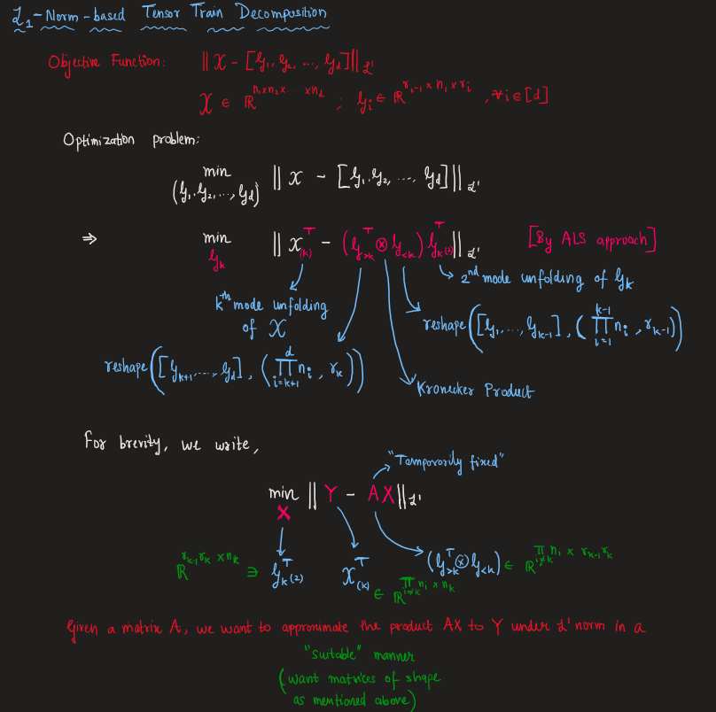

# Tensor_Train_Decomp
Exploring Tensor-Train Decomposition | Summer 2024 Research @ IITGN | Prof. Anirban Dasgupta 

### Methods Explored:
1) ALS based approach inspired from paper "LOW-RANK TENSOR TRAIN DECOMPOSITION USING TENSORSKETCH"
   Approach reduces to updating each TT-core by solving a **Least Absolute Difference (LAD)**. Solving LAD is **NP-hard**. 
    
   #### LAD Problem
   $\text{For a matrix A} \in \R^{n \times d} \text{ and } b \in \R^{n} \text{, find } x \in \R^{d} \text{ that minimizes the below objective function:}$
   $$ \min_{x} ||Ax-b||_{L^1}$$
   Solved LAD via the following techniques:
   - **Linear Programming**:
     - Global solution obtained for the following LP formulation of LAD:
        $$ \min_{x \in \R^d, \text{ } t \in \R^n} 1^Tt $$
        such that
        $$ Ax-b \le t \text{ and } -Ax + b \le t $$
      - Global optimality of LAD solutions **may not** translate to global optimality of ALS updates framework.
      - Some empirical observations:
        - Method quite slow. Works only with small number of low-dimensions.
        - Increasing TT-ranks reduces relative error but increases compute time.
        - Bounding the values of $x$ is necessary as TT core values take arbitrarily small and large values. Bounds can be added as constraints in LP.
        - Bounding the values of $x$ to the order of magnitude of data works fine. Increasing these bounds can lead to increased relative error.

